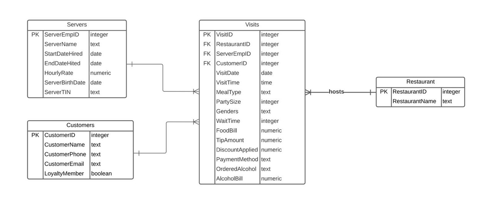

# Restaurant Database Design - Part B

## 1. Functional Dependencies

- VisitID → {Restaurant, ServerEmpID, ServerName, VisitDate, VisitTime, MealType, PartySize, Genders, WaitTime, CustomerName, CustomerPhone, CustomerEmail, LoyaltyMember, FoodBill, TipAmount, DiscountApplied, PaymentMethod, orderedAlcohol, AlcoholBill}

- ServerEmpID → {ServerName, StartDateHired, EndDateHired, HourlyRate, ServerBirthDate, ServerTIN}
- CustomerEmail → {CustomerName, CustomerPhone, LoyaltyMember}
- CustomerPhone → {CustomerName, CustomerEmail, LoyaltyMember}
- ServerTIN → {ServerEmpID}

## 2. Relations Decomposed

#### **1. Restaurants**
- **Attributes**: RestaurantID (PK), RestaurantName

#### **2. Servers**
- **Attributes**: ServerEmpID (PK), ServerName, StartDateHired, EndDateHired, HourlyRate, ServerBirthDate, ServerTIN
- **Constraints**: ServerTIN should be unique

#### **3. Customers**
- **Attributes**: CustomerID (PK), CustomerName, CustomerPhone, CustomerEmail, LoyaltyMember
- **Constraints**: CustomerEmail and CustomerPhone should be unique

#### **4. Visits**
- **Attributes**: VisitID (PK), RestaurantID (FK), ServerEmpID (FK), CustomerID (FK), VisitDate, VisitTime, MealType, PartySize, Genders, WaitTime, FoodBill, TipAmount, DiscountApplied, PaymentMethod, orderedAlcohol, AlcoholBill
- **Foreign Keys**: References Restaurants, Servers, and Customers tables

## 3. Entity Relationship Diagram (ERD)

<!--  -->

```{r echo=FALSE}
    download.file("https://i.postimg.cc/d0hkwwPK/ERD.jpg", destfile = "ERD.jpg", mode = "wb")
    
```

### Relationships:
- **Restaurants to Visits**: One-to-Many (One restaurant can have many visits)
- **Servers to Visits**: One-to-Many (One server can serve many visits)
- **Customers to Visits**: One-to-Many (One customer can make many visits)

